<h1 align="center">MangoByte</h1>

<p align="center">
	<a href="https://discord.gg/d6WWHxx">
		
	</a>
	<a href="https://discord.gg/d6WWHxx">
		
	</a>
	<br>
	<a href="https://discord.gg/d6WWHxx">
		
	</a>
</p>

<!-- Note that parts of this file are auto-generated, which is why theres some html comment placeholders below -->

Mangobyte is a discord bot primarily focused on providing information about the game Dota 2, and doing text-to-speech in a voice channel. The text-to-speech has many different forms, including playing clips, playing voice lines from dota, and doing tts from user input. The Dota 2 information is both information about the players and their recent matches, as well as information extracted from the game itself about the stats of various heroes. It can also play an intro for users when they join the voice channel it is in. It is highly configurable, allowing server/guild owners to configure various options for their servers, as well as users to configure various options for themselves. I'm using the [disnake](https://github.com/DisnakeDev/disnake) python wrapper for the [Discord API](https://discordapp.com/developers). I'm also making use of [dotabase](https://github.com/mdiller/dotabase), which is an open source repository (created by yours truly) containing data about the game [Dota 2](http://www.dota2.com).

## Inviting Mangobyte

Want to try out mangobyte on your server? <!-- INVITE_LINK_START -->[Invite Link](https://discordapp.com/oauth2/authorize?permissions=314432&scope=bot%20applications.commands&client_id=213476188037971968)<!-- INVITE_LINK_END -->

## Slash Command Migration

Mangobyte is currently in the process of migrating over to slash commands. If you are having issues getting slash commands working properly in your server, try taking a look at [Slash Command Common Issues](docs/slash_command_common_issues.md). If you use mangobyte already and want to know why we're switching to slash commands or just want more information on it, run the command `/docs Slash Commands`.

**Current Migration Progress:** <!-- SLASH_PROGRESS_PERCENT_START -->80%<!-- SLASH_PROGRESS_PERCENT_END -->

## Commands

<!-- COMMANDS_START -->
Mangobyte currently has 74 commands, separated into 6 categories

#### General
Commands that don't really fit into the other categories

```
/bot changelog       | Gets a rough changelog for mangobyte                                               
/bot donate          | Posts some links with info about how to donate to the developer                    
/bot info            | Prints info about mangobyte                                                        
/bot invite          | Shows the invite link                                                              
/bot stats           | Displays some bot statistics                                                       
/docs                | Shows some documentation about a specific part of the bot                          
/echo                | Echos the given message                                                            
?help                | Shows this message                                                                 
/misc ask            | A magic 8-ball style question answerer                                             
/misc cat            | Gets a picture of the developer's cat                                              
/misc choose         | Randomly chooses one of the given options                                          
/misc dog            | Gets a picture of one of the developer's dogs                                      
/misc insult         | Insults the given victim, or you if you dont target anyone                         
/misc lasagna        | Posts an image of a baked italian dish                                             
/misc random         | Gets a random number between the minimum and maximum (inclusive)                   
/misc scramble       | Scrambles the insides of words                                                     
/misc showerthought  | Gets a top post from the r/ShowerThoughts subreddit                                
/ping                | Pongs a number of times(within reason)                                             
/reddit              | Displays a formatted reddit post                                                   
/userconfig          | Configures the bot's user-specific settings                                        
/wiki                | Looks up a thing on wikipedia                                                      
```

#### Audio
For playing audio in a voice channel

```
/clipinfo            | Gets information and a file for the given clip                                     
/clips chatwheel     | Shows a list of chatwheel lines                                                    
/clips dota          | Plays a dota response                                                              
/clips local         | Lists the names of local audio clips. For more info on clips, see '/docs Clips'    
/play chatwheel      | Plays the given chat wheel sound. Try '/clips chatwheel' to get a list of clips.   
/play dota           | Plays a dota response. Try '/clips dota' for a similar command that returns a list 
/play local          | Plays a local audio clip. For more information on clips, see `/docs Clips`         
/play tts            | Converts the given message to speech and plays the tts clip                        
/replay              | Replays the last played clip                                                       
/say                 | Plays a sound clip based on the message given, drawing from multiple clip types    
/stop                | Stops the currently playing clip                                                   
```

#### Dotabase
For information about the game Dota 2 [Patch **7.31b**]

```
?abilities           | Shows all of the abilities/spells for that hero                                    
?ability             | Gets information about a specific hero ability                                     
?aghanim             | Gets the aghs upgrade for the given hero or ability                                
/courage             | Generates a challenge build with a random hero and items                           
/emoticon add        | Adds a dota emoticon as an animated emoji to this server                           
/emoticon show       | Gets the gif of a dota emoticon                                                    
/fuseheroes          | Visually fuse together two heroes                                                  
/hero                | Gets information about a specific hero                                             
?herotable           | Displays a sorted table of heroes and their stats                                  
/item                | Gets information about a specific dota 2 item                                      
?leveledstats        | Gets the stats for a hero at the specified level                                   
/lore                | Gets the lore of a hero, ability, or item                                          
?neutralitems        | Displays all of the neutral items                                                  
/recipe              | Shows the recipes involving this item                                              
/talents             | Gets the talents of a specific hero                                                
```

#### DotaStats
Commands for displaying information about Dota 2 players and matches

```
/dotagif             | Creates a gif of a specific part of a dota match                                   
/firstmatch          | Gets info about the player's first dota game                                       
/lm                  | Gets info about the player's last dota game                                        
/match graph         | Creates a graph for a dota match                                                   
/match info          | Creates a table with some basic stats and information about the dota match         
/match laning        | Creates gif of the laning stage with a caption                                     
/match skillbuild    | Gets the ability upgrades for a match                                              
/match story         | Tells the story of the match                                                       
/matchids            | Gets a list of recent matchids that match the given filter                         
/meta                | Prints the top meta heroes from https://opendota.com/heroes                        
?parse               | Requests that OpenDota parses a match                                              
/playerstats         | Gets stats about the player's dota matches                                         
/profile             | Displays information about the player's dota profile                               
/recent              | Gets a list of your recent dota matches                                            
/rolesgraph          | Gets a graph displaying the dota player's hero roles                               
/twenty              | Gets stats from the player's last 20 parsed games                                  
/whoishere           | Shows the linked steam accounts of anyone who is in voice chat with mango          
```

#### Pokemon
Pokemon related commands

```
/pokecry             | Plays the pokemon's sound effect                                                   
/pokemon             | Looks up information about the given pokemon                                       
```

#### Admin
Commands to help manage mangobyte on your server/guild

```
?botban              | Bans the user from using commands                                                  
?botunban            | Unbans the user, allowing them to use commands                                     
/config              | Configures the bot's settings for this server/guild                                
?disablecommand      | Disabled the specified command or command category                                 
?enablecommand       | Re-enables the specified command or command category                               
?resummon            | Re-summons the bot to the voice channel                                            
?summon              | Summons the bot to the voice channel                                               
?unsummon            | Removes the bot from the voice channel                                             
```

<!-- COMMANDS_END -->

## Examples

`?hero brew`

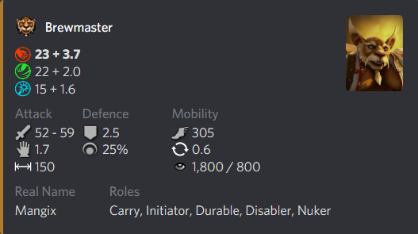

`?ability dream coil`

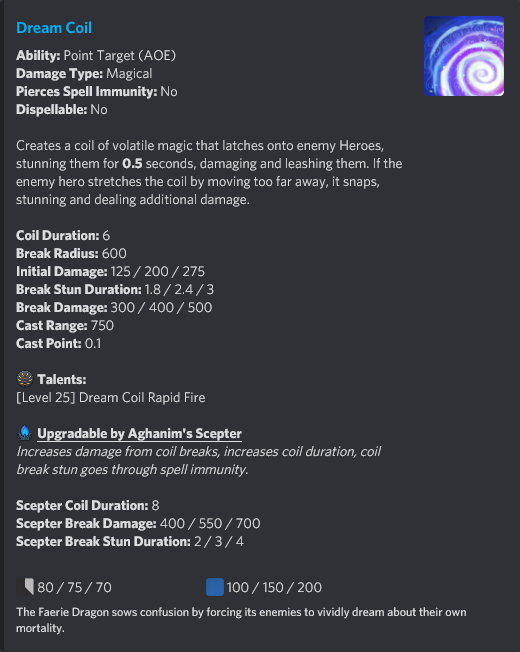

`?item silver edge`

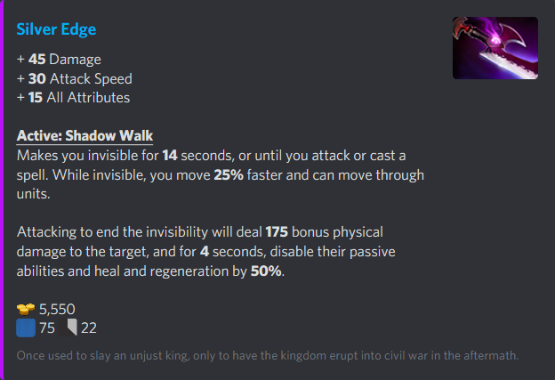

`?herotable lvl 20 effective hp`


`?lastmatch as skywrath this patch`

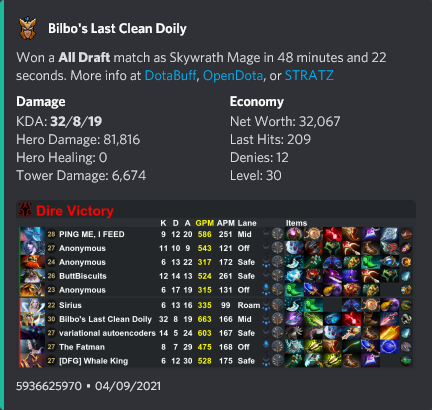

`?playerstats`

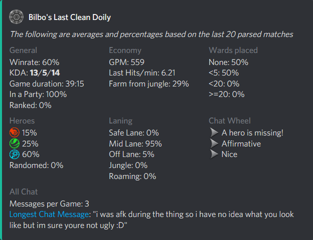

`?twenty`

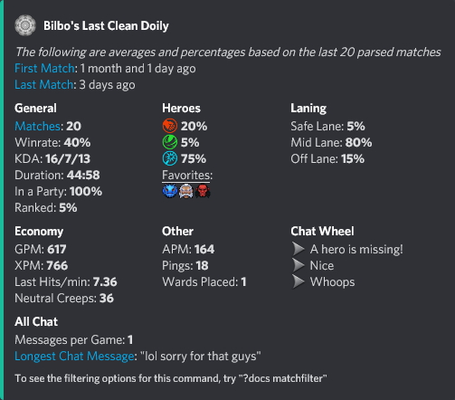

`?laning`


`?recent`

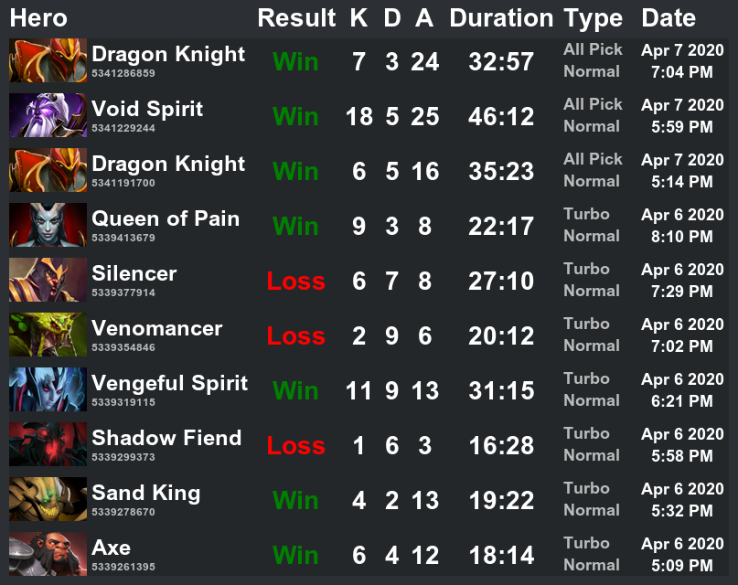

`?recent tinker wins` (See the options you can use for this [here](resource/docs.md))

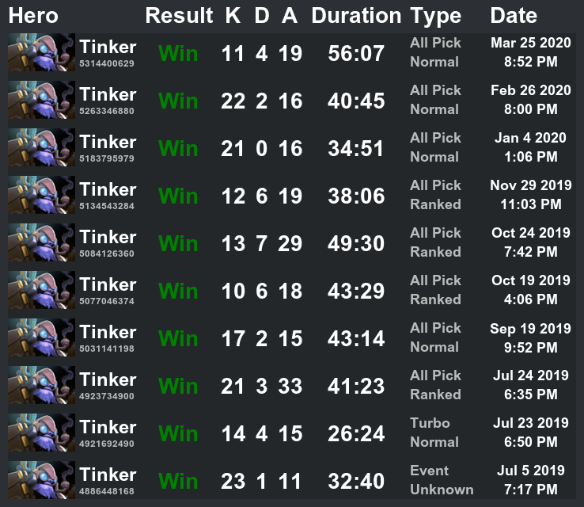

`?rolesgraph`

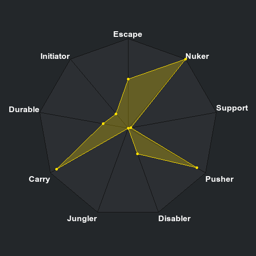

`?help config`

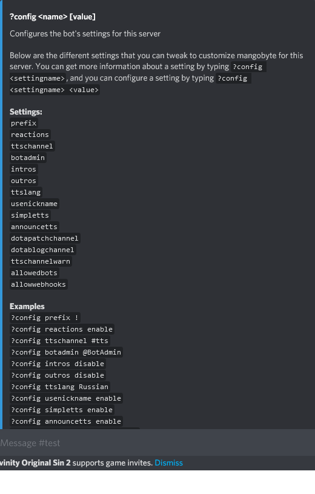

`?help userconfig`

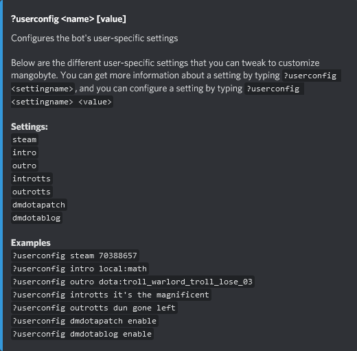


## Installation

I would recommend simply inviting mangobyte to your server via the <!-- INVITE_LINK_START -->[Invite Link](https://discordapp.com/oauth2/authorize?permissions=314432&scope=bot%20applications.commands&client_id=213476188037971968)<!-- INVITE_LINK_END -->, but if you want to contribute to mangobyte or just like running code, the following is how you can install and run your own instance of mangobyte.

Before installing and running your own instance of mangobyte, you will first need to install the following:

* Python 3.9
* Pip
* Dependencies: `python3.9 -m pip install -r requirements.txt`
* [ffmpeg](https://ffmpeg.org) (the tool used for playing audio)
* [gifsicle](https://www.lcdf.org/gifsicle/) (the tool used for creating gifs)

If you run `python3.9 mangobyte.py`, you will probably get an error message because the bot token isn't set. You'll have to [create a bot account](https://twentysix26.github.io/Red-Docs/red_guide_bot_accounts/) through discord in order to get one of these tokens. Note that the above link is for a different discord bot, and so the "Logging in with a token" section does not apply here. Now that you have a bot account, set the `token` field in the `settings.json` file to your new bot's token. After you have done this, and have invited your bot to your server, don't forget to add the ID of the voice channel you want to connect it to in the `defaultvoice` field in the `settings.json` file.

You should now be done! You can run mangobyte by calling `python3.9 mangobyte.py`, and you should probably set up a virtual environment so that nothing bad has a chance of happening.

### Example settings.json file

```json
{
	"token": "<token here>",
	"error_logging": false,
	"debug": false
}
```
For explanation of each option, see the comments on the properties in [settings.py](cogs/utils/settings.py)
